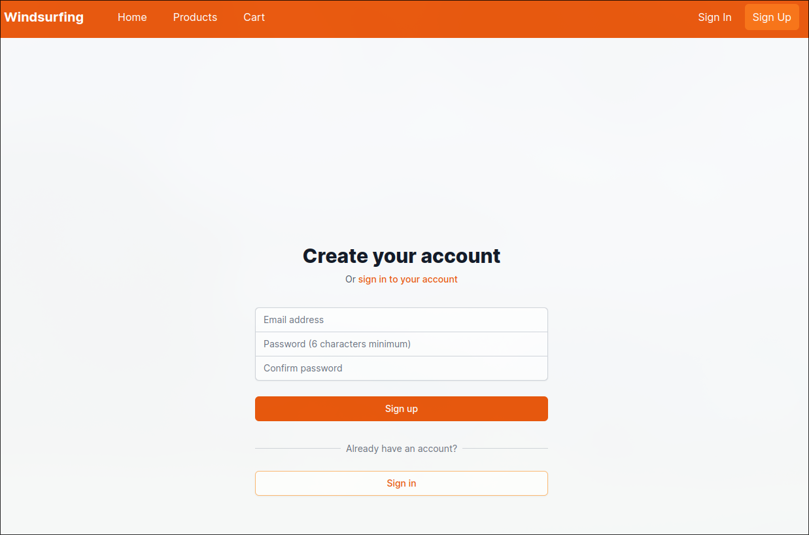
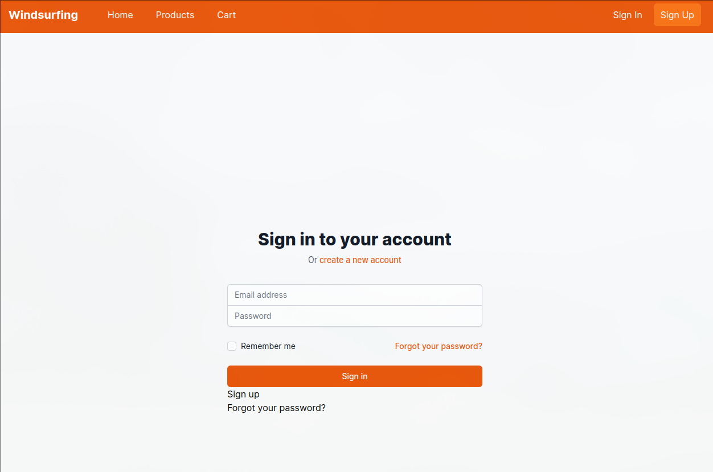
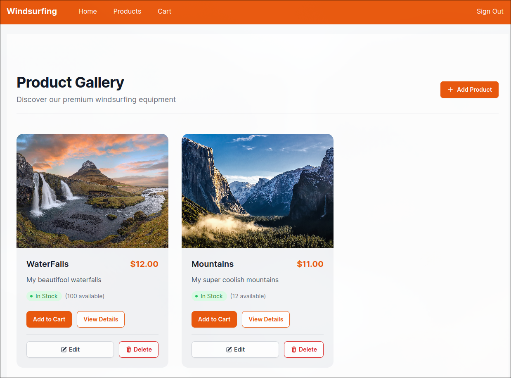
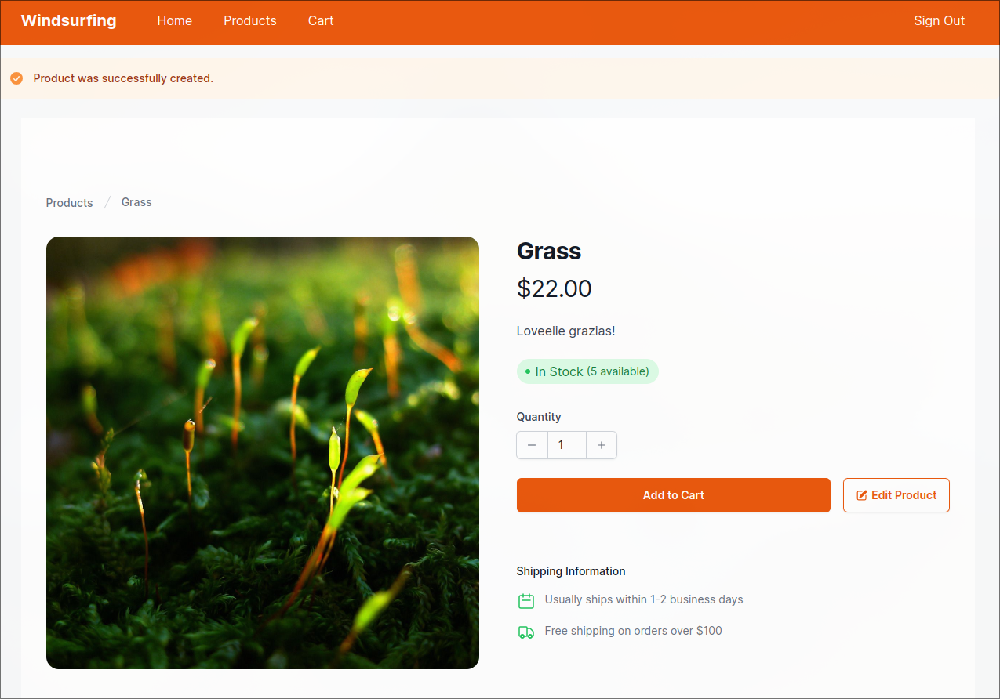
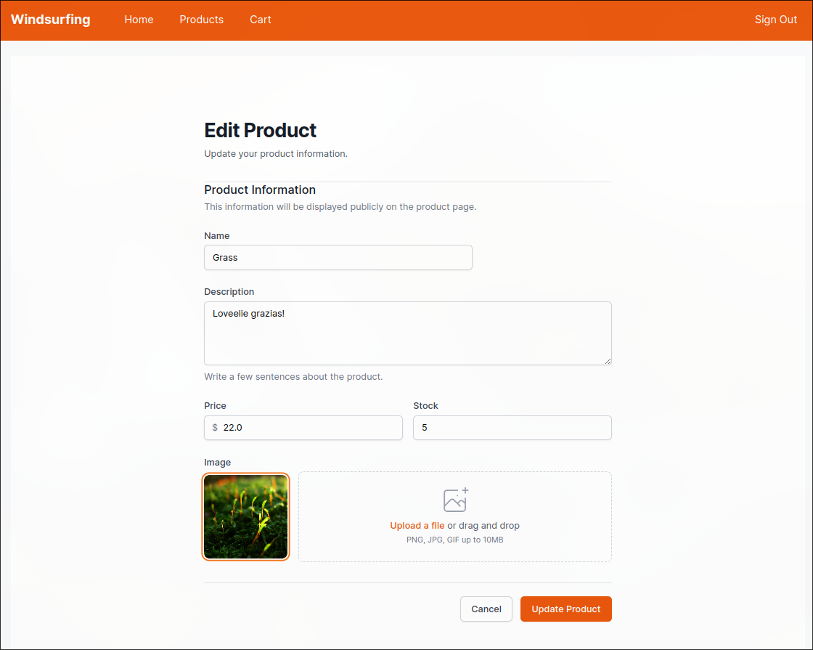
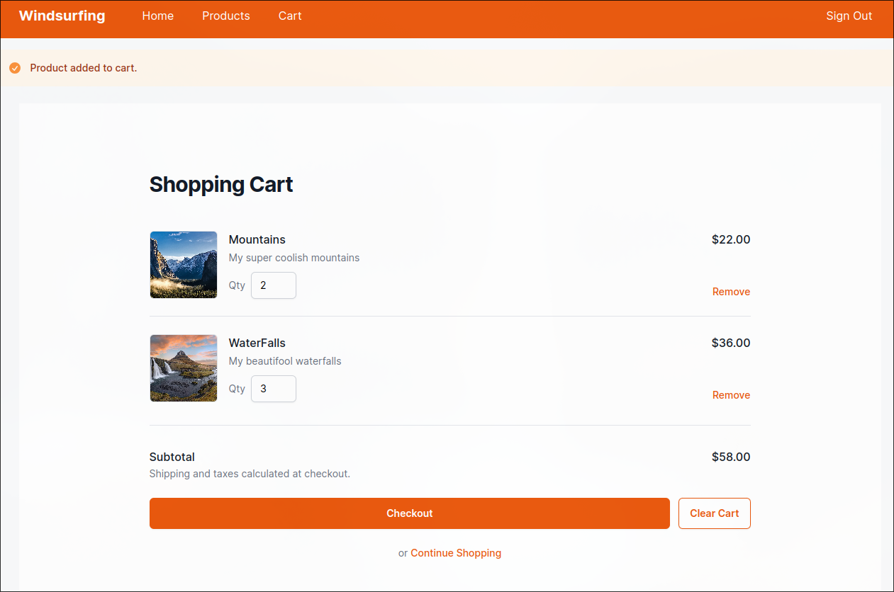
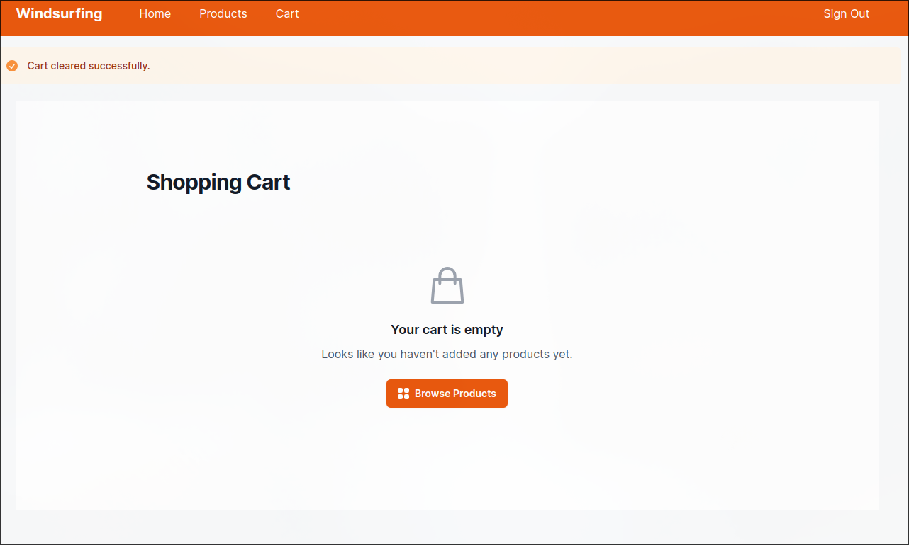

 
# Windsurfing E-Commerce Platform 🏄

[](https://github.com/andrewpaliyan/windsurfing/actions/workflows/ci.yml)
[](https://github.com/rubocop/rubocop)
[](https://rubyonrails.org/)
[](https://tailwindcss.com/)

A modern, responsive e-commerce platform built with Ruby on Rails and Tailwind CSS, specialized for windsurfing equipment and accessories.
















## ✨ Features

- 🛍️ **Product Management**
  - Full CRUD operations for products
  - Image upload support via Active Storage
  - Stock tracking
  - Detailed product views with image gallery

- 🛒 **Shopping Cart**
  - Real-time cart updates
  - Quantity management
  - Stock validation
  - Dynamic price calculations

- 👤 **User Authentication**
  - Secure user registration and login
  - Role-based authorization
  - Protected admin routes

- 🎨 **Modern UI/UX**
  - Responsive design
  - Orange-themed styling
  - Interactive components
  - Tailwind CSS utilities

## 🚀 Tech Stack

- **Framework**: Ruby on Rails 8.0
- **Database**: SQLite
- **Frontend**: 
  - Tailwind CSS
  - Stimulus.js
  - Turbo
- **Authentication**: Devise
- **File Storage**: Active Storage
- **JavaScript**: ES6+

## 🧪 Test Coverage

### Controller Tests

#### Products Controller
- ✅ Index action displays all products
- ✅ Show action displays product details
- ✅ Create action adds new product
- ✅ Update action modifies product
- ✅ Delete action removes product
- ✅ Handles invalid product data

#### Cart Items Controller
- ✅ Create adds item to cart
- ✅ Update modifies item quantity
- ✅ Delete removes item from cart
- ✅ Validates stock levels
- ✅ Handles invalid quantities
- ✅ Prevents exceeding stock
- ✅ Supports both HTML and JSON formats

#### Orders Controller
- ✅ Create new order
- ✅ Show order details
- ✅ List user orders
- ✅ Validates order status
- ✅ Calculates order total

### Model Tests

#### Product
- ✅ Validates presence of name, description
- ✅ Validates price is positive
- ✅ Validates stock is non-negative
- ✅ Handles image attachments

#### Cart
- ✅ Calculates total price
- ✅ Manages cart items
- ✅ Validates quantities
- ✅ Enforces stock limits

#### Order
- ✅ Validates status values
- ✅ Calculates total
- ✅ Manages order items
- ✅ Associates with user

## 🛠️ Continuous Integration

Our CI pipeline ensures code quality and test reliability:

- 🔄 **Automated Tests**
  - Runs full test suite
  - Controller tests
  - Model tests
  - Integration tests
  - System tests

- 📊 **Code Quality**
  - RuboCop style checks
  - Security vulnerability scans
  - Code coverage reports
  - Performance analysis

- 🏗️ **Build Process**
  - Dependency installation
  - Database migrations
  - Asset compilation
  - Environment setup

### Latest CI Status

| Check | Status |
|-------|--------|
| Tests | [](https://github.com/andrewpaliyan/windsurfing/actions/workflows/ci.yml) |
| Code Style | [](https://github.com/andrewpaliyan/windsurfing/actions/workflows/rubocop.yml) |
| Security | [](https://github.com/andrewpaliyan/windsurfing/actions/workflows/security.yml) |
| Coverage | [](https://codecov.io/gh/andrewpaliyan/windsurfing) |

## 📦 Installation

1. Clone the repository
```bash
git clone [repository-url]
cd windsurfing
```

2. Install dependencies
```bash
bundle install
yarn install
```

3. Setup database
```bash
rails db:create
rails db:migrate
```

4. Start the server
```bash
bin/dev
```

5. Visit `http://localhost:3000`

## 💻 Development

- Run tests: `rails test`
- Run linter: `rubocop`
- Generate ERD: `rails erd`

## 🔒 Environment Variables

Create a `.env` file in the root directory and add:

```
DATABASE_URL=your_database_url
RAILS_MASTER_KEY=your_master_key
```

## 📝 Contributing

1. Fork the repository
2. Create your feature branch (`git checkout -b feature/amazing-feature`)
3. Commit your changes (`git commit -m 'Add some amazing feature'`)
4. Push to the branch (`git push origin feature/amazing-feature`)
5. Open a Pull Request

## 📄 License

This project is licensed under the MIT License - see the [LICENSE.md](LICENSE.md) file for details.

## 🙏 Acknowledgments

- Ruby on Rails team
- Tailwind CSS team
- All contributors and supporters